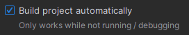
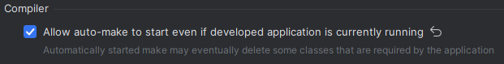
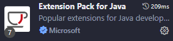

  

> Este é um projeto  que compõe a plataforma Facilita Ai. Ele é dividido em dois componentes principais que trabalham de forma integrada:

- **Back-end (API)**: Uma API RESTful, construída com Java e Spring Boot. É responsável por toda lógica de negócios, gerenciamento de serviços (CRUD) para as entidades do site, autenticação de usuários (via JWT) e persistência de dados.

- **Front-end (UI)**: Uma Single Page Application (SPA) desenvolvida em Vue.js. Responsável por consumir a API e entregar a interface aos usuários, permitindo a interação do usuário com os serviços da plataforma.

## 🚀 Tecnologias Utilizadas

### Back-end (API)

- [Java 21](https://docs.spring.io/spring-boot/index.html)
- [Spring Boot](https://docs.spring.io/spring-boot/index.html)
- [PostgreSQL](https://www.postgresql.org/)
- [JWT (Java Web Token)](https://jwt.io/)
- [Swagger (SpringDoc)](https://springdoc.org/)

### Front-end (UI)

- [Vue.js 2.x](https://vuejs.org/)
- [Axios](https://axios-http.com/)
- [Node.js](https://nodejs.org/en/) (para o ambiente de build/dev)

### Ambiente

- [Docker](https://www.docker.com/) e Docker Compose

## 📦 Instalação e Execução Local

Este projeto foi desenvolvido para rodar em dois modos: **Desenvolvimento** e **Integração**.

### Pré-requisitos

Antes de começar, garanta que você tem as seguintes ferramentas instaladas localmente:

- [Git](https://git-scm.com/)
- [Docker](https://www.docker.com/products/docker-desktop/) e Docker Compose
- [Java JDK 21 (ou superior)](https://www.oracle.com/java/technologies/javase/jdk21-archive-downloads.html)
- [Apache Maven](https://maven.apache.org/download.cgi) (ou use o wrapper `mvnw` incluído)
- [Node.js e npm](https://nodejs.org/en/)

---
### 1. Estruturas de pastas

**Crie um diretório para os dois repositórios**

```bash
mkdir Facilita-ai
cd Facilita-ai
```
**Clone os repositórios**

```bash
git clone https://github.com/PET-Sistemas/BACK-Facilita-ai.git
git clone https://github.com/PET-Sistemas/FRONT-Facilita-ai.git
```

**Os arquivos devem estar organizados da seguinte maneira**

        /Facilita-ai
        |── BACK-facilita-ai/
        |── FRONT-Facilita-ai/

## 2. Desenvolvimento

**Terminal 1: Subir o Banco de Dados usando Docker**

```bash
# Na pasta do back-end
cd BACK-facilita-ai
docker compose up getpet_db
```

**Terminal 2: Rodar o Back-end local com Hot-Reload**

```bash
# Navegue para a pasta do back-end
cd BACK-facilita-ai
cd back-facilita-ai # Novamente
mvn clean install
# Rode o Spring Boot (o perfil 'dev' é ativado via pom.xml)
./mvnw spring-boot:run
```

(O back-end estará rodando em http://localhost:8080)  
(A documentação da api pode ser acessada em http://localhost:8080/swagger-ui.html).

### 2.1. InteliJ IDE

    Para aplicar mudanças no back-end automaticamente é necessario ativar as seguintes opções nas configurações da IDE em

    File > Settings > Build, Execution, Deployment > Compiler

    Ative a opção:

<div align="center">
  
</div>

    File > Settings > Advanced Settings > Compiler

    Ative a opção:

<div align="center">
  
</div>

### 2.2. VSCode

    Para aplicar mudanças no back-end automaticamente é necessario incluir a extensão

<div align="center">
  
</div>

---

**Terminal 3: Rodar o Front-end local com Hot-Reload**

```bash
# Navegue para a pasta do front-end
cd FRONT-Facilita-ai

# Instale as dependências (apenas na primeira vez)
npm install

# Rode o servidor de desenvolvimento (com HMR)
npm run serve
```

(O front-end estará rodando em http://localhost:8081)  
(O hot-reload é feito automaticamente)

---


## 3. Produção

**Terminal 1: Subir a Stack completa**

```bash
docker compose up --build
```

(O acesso ao serviço e feito em http://localhost:8081)  
(A documentação da Api pelo Swagger está desativada em modo produção)

---

## 📝 Observações

- Certifique-se de que o backend está rodando e acessível para o frontend funcionar corretamente.
- Para personalizar a URL do backend, edite o arquivo `src/plugins/axios.js`.

---

## 👨‍💻 Contribuição

Sinta-se à vontade para abrir issues e pull requests!

---

## 📢 Contato

Dúvidas ou sugestões? Entre em contato com o time PET-Sistemas.
